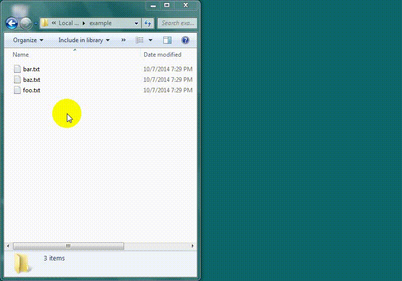

Archiver
========
Utility for archiving files. An archive consists of a zip file containing the archived files and directories plus a log file.

There are two variations of this application:

  - **Archiver** - Command line archiving utility.
  - **gArchiver** - GUI archiving utility.

Log comments are saved in an <code>\_\_archive\_info\_\_.txt</code> file located in the top-level of the archive. The log uses [Asciidoc](http://www.methods.co.nz/asciidoc/) formatting.

Timestamps are appended to the beginning of the archive filename and separated by a hyphen. The default timestamp format is *YYYYMMDDhhmm*.

This application was written in Python. The command line utility uses the Docopt library. The graphical utility uses the wxPython GUI library. To run the application from source, the following dependencies are required:

  - [Python](http://python.org/) 2.7 (although other 2.x version may work)
  - [wxPython](http://wxpython.org/) 3.0.0.0 (gArchiver only)
  - [Docopt](https://github.com/docopt/docopt) 0.6.2 (Archiver only)

Windows binaries of the two utility variations are built using [PyInstaller](http://www.pyinstaller.org/) 2.0; the binaries should be standalone and do not require any additional dependencies. To use the command line Archiver utility, simply add the `archiver.exe` file to a location accessible on the PATH. To use the GUI gArchiver utility, add a shortcut to `garchiver.exe` in the Windows Explorer "Send to" menu.

A demo of gArchiver in action is shown below:

